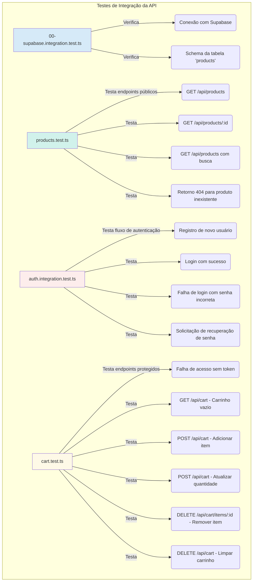

# STG Catalog Challenge 🚀


---

## 📄 Sobre o Projeto

O **STG Catalog Challenge** é uma aplicação de e-commerce full-stack que simula uma experiência de compra online real, desde a autenticação do usuário até a finalização do pedido via WhatsApp. O projeto foi construído com foco em boas práticas de desenvolvimento, componentização, testabilidade e uma arquitetura moderna e escalável.

---

## ✨ Funcionalidades em Destaque

-   **Autenticação Segura com Supabase:** Fluxo completo de registro, login, e recuperação de senha.
-   **Catálogo de Produtos Dinâmico:** Listagem de produtos com busca em tempo real.
-   **Carrinho de Compras Persistente:** O carrinho de cada usuário é salvo no banco de dados.
-   **Checkout via WhatsApp:** Geração de uma mensagem de pedido formatada para um checkout rápido e prático.
-   **Testes de Integração:** Suíte de testes robusta para a API, garantindo a confiabilidade das regras de negócio.

---

## 🔧 Arquitetura e Funcionamento do Sistema

O projeto é um monorepo com duas aplicações principais: `backend` e `frontend`. A comunicação entre elas é feita através de uma API RESTful.

### 🌐 **Backend (Node.js + Express + TypeScript)**

O backend é responsável por todas as regras de negócio, interações com o banco de dados e segurança.

#### Autenticação e Autorização

A autenticação é delegada ao Supabase, mas a autorização é controlada pela nossa API através de um middleware.

1.  O **Frontend** utiliza a biblioteca cliente do Supabase para registrar/logar o usuário, recebendo um token JWT.
2.  Para requisições a rotas protegidas (ex: `/cart`), o token JWT é enviado no cabeçalho `Authorization`.
3.  O nosso **Backend** intercepta essa requisição com o middleware `auth.middleware.ts`, que valida o token junto ao Supabase. Se o token for válido, a requisição prossegue; caso contrário, é barrada.

```typescript
// backend/src/api/middlewares/auth.middleware.ts

// O middleware extrai o token, valida com o Supabase e anexa os dados do usuário à requisição.
export const authMiddleware = async (req: Request, res: Response, next: NextFunction) => {
  const authHeader = req.headers.authorization;
  // ... (validação do cabeçalho)
  const { data, error } = await supabase.auth.getUser(token);

  if (error || !data.user) {
    return res.status(401).json({ message: 'Token inválido ou expirado.' });
  }
  (req as any).user = data.user; // Anexa o usuário na requisição
  next();
};
```

#### Gerenciamento do Carrinho

O carrinho de compras de cada usuário é persistido na tabela `cart_items`. As operações são seguras, pois a API sempre utiliza o `user_id` do usuário autenticado (validado pelo middleware) para realizar as queries.

A lógica de "adicionar ou atualizar" (upsert) é tratada de forma eficiente pelo serviço do carrinho, utilizando a funcionalidade `onConflict` do Supabase para evitar duplicatas do mesmo produto para o mesmo usuário.

```typescript
// backend/src/api/services/cart.service.ts

// O serviço usa o supabaseAdmin para contornar a RLS e operar com segurança no banco.
export const upsertCartItem = async (userId: string, productId: number, quantity: number) => {
  const { data, error } = await supabaseAdmin
    .from('cart_items')
    .upsert(
      { user_id: userId, product_id: productId, quantity },
      { onConflict: 'user_id,product_id' } // Se o par user_id/product_id já existir, atualiza a quantidade.
    )
    .select();
  // ...
};
```

### ⚛️ **Frontend (React + Vite + TypeScript)**

O frontend é uma Single Page Application (SPA) reativa e componentizada, responsável por toda a interface do usuário.

#### Gerenciamento de Estado Global

Utilizamos a **Context API** do React para gerenciar o estado global da aplicação, dividindo as responsabilidades em dois contextos principais:

1.  **`AuthContext`**: Gerencia a sessão do usuário. Ele escuta as mudanças de estado de autenticação do Supabase e disponibiliza o `user` e a `session` para toda a aplicação.
2.  **`CartContext`**: Gerencia os itens do carrinho, o estado de carregamento e o preço total. Ele encapsula toda a lógica de interação com a API de carrinho do backend.

```tsx
// frontend/src/contexts/CartContext.tsx

// O CartProvider busca o carrinho assim que o usuário é autenticado.
export const CartProvider = ({ children }) => {
  const { user } = useAuth();

  const fetchCart = useCallback(async () => {
    if (!user) return;
    const { data } = await api.get('/cart'); // Chama a API do nosso backend
    setCartItems(data);
  }, [user]);

  useEffect(() => {
    fetchCart();
  }, [fetchCart]);

  // ... (funções de adicionar, remover, etc.)
};
```

#### Roteamento e Proteção de Rotas

Utilizamos o `react-router-dom` para gerenciar a navegação. Rotas sensíveis são protegidas pelo componente `ProtectedRoute`, que verifica se existe uma sessão ativa no `AuthContext`.

```tsx
// frontend/src/routes/index.tsx

// A rota "/" e suas filhas são envolvidas pelo ProtectedRoute.
const router = createBrowserRouter([
  { path: '/login', element: <AuthPage /> },
  {
    path: '/',
    element: <ProtectedRoute />, // Componente de proteção
    children: [
      {
        element: <MainLayout />,
        children: [
          { index: true, element: <CatalogPage /> },
          // ... outras rotas protegidas
        ],
      },
    ],
  },
]);
```

### 🧪 **Testes de Integração do Backend**

Para garantir a qualidade e a estabilidade da API, criamos uma suíte de testes de integração robusta com Jest e Supertest.

#### Estratégia de Testes

Os testes simulam o comportamento real de um cliente HTTP, fazendo requisições à nossa API e validando as respostas, os códigos de status e os dados retornados pelo banco de dados.

Para garantir um ambiente de teste limpo e isolado:
-   Os testes são executados sequencialmente (`--runInBand`).
-   Um **usuário de teste é criado no início** de cada suíte de teste que requer autenticação e **removido ao final**, utilizando um helper (`auth.helper.ts`) que interage diretamente com a API de administração do Supabase.

```typescript
// backend/src/__tests__/utils/auth.helper.ts

// Helper para criar um usuário de teste com dados aleatórios
export const createTestUser = async () => {
  const email = `test.${uuidv4()}@example.com`;
  const password = 'password123';
  // ...
  const { data, error } = await supabaseAdmin.auth.admin.createUser({
    email,
    password,
    email_confirm: true, // Cria o usuário já confirmado
  });
  // ...
  return { user, session, email, password };
};
```

#### Suítes de Teste e Cobertura

Os testes cobrem as principais funcionalidades da API. O diagrama abaixo ilustra as suítes de teste e os cenários cobertos:

---

## 📊 Gráfico de Cobertura de Testes da API


---

## ⚙️ Como Executar o Projeto

Siga os passos abaixo para rodar a aplicação localmente.

### Pré-requisitos

-   Node.js (v18 ou superior)
-   npm ou yarn
-   Uma conta no [Supabase](https://supabase.com/)

### 1. Backend

```bash
# 1. Navegue para a pasta do backend
cd backend

# 2. Instale as dependências
npm install

# 3. Crie um arquivo .env na raiz de /backend e adicione as seguintes variáveis:
# Você pode encontrar essas chaves no painel do seu projeto Supabase
# (Project Settings -> API)
PORT=3333
SUPABASE_URL=SUA_SUPABASE_URL
SUPABASE_ANON_KEY=SUA_SUPABASE_ANON_KEY
SUPABASE_SERVICE_ROLE_KEY=SUA_SUPABASE_SERVICE_ROLE_KEY

# 4. Inicie o servidor de desenvolvimento do backend
npm run dev

# 5. (Opcional) Para rodar os testes de integração:
npm test
```

### 2. Frontend

```bash
# 1. Em um novo terminal, navegue para a pasta do frontend
cd frontend

# 2. Instale as dependências
npm install

# 3. Crie um arquivo .env.local na raiz de /frontend e adicione as seguintes variáveis:
# O VITE_ é um prefixo obrigatório para variáveis de ambiente no Vite
VITE_SUPABASE_URL=SUA_SUPABASE_URL
VITE_SUPABASE_ANON_KEY=SUA_SUPABASE_ANON_KEY
VITE_API_BASE_URL=http://localhost:3333/api

# 4. Configure a URL do site no Supabase para o fluxo de recuperação de senha:
# Vá em Authentication -> URL Configuration e defina a "Site URL" como http://localhost:5173

# 5. Inicie o servidor de desenvolvimento do frontend
npm run dev
```

Agora você pode acessar a aplicação em `http://localhost:5173`.

---

## 🤖 Uso de Inteligência Artificial

Este projeto foi desenvolvido com o auxílio de uma Inteligência Artificial (Gemini, via Cursor). A IA foi utilizada para:

-   **Geração de Código:** Criação de boilerplate para componentes, serviços e testes.
-   **Análise e Debugging:** Identificação de erros de lógica, sintaxe e integração.
-   **Refatoração:** Sugestão de melhorias e otimizações no código.
-   **Documentação:** Geração de comentários e deste `README.md`.

A IA atuou como uma ferramenta de produtividade, acelerando o desenvolvimento e auxiliando na resolução de problemas complexos, sempre sob a supervisão e direção do desenvolvedor.
